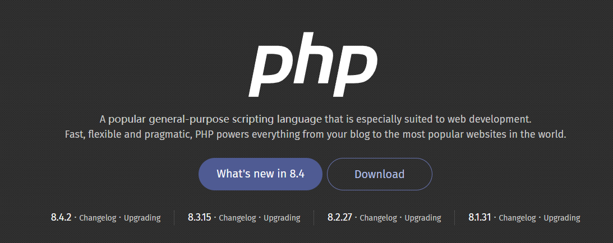

# PHP8+Apache

[参考博客](https://blog.csdn.net/qq_17790209/article/details/115679141)

## 配置PHP

> 下载[链接](https://windows.php.net/download)
> 注意这里要下载`Thread Safe`的版本，而不是`Non Thread Safe`，否则后期整合Apache时会出现缺少必要文件


复制`php.ini-development`文件，重命名为`php.ini`

在该路径下输入命令查看版本信息

```sh
php.exe -v
```


添加到环境变量到`path`

```
D:\env\PHP8
```

然后输入如下命令即可查看版本信息

```sh
php -v
```


## 配置Apache

> 下载[链接](https://www.apachelounge.com/download/)
> 下载`Win64`版本，解压之后关注`Apache24`目录的配置即可

配置`Apache24\conf\httpd.conf`文件


这里`SRVROOT`设置为自己的目录，**需要**`注意`路径中不要写`\`，而是`/`


这里的`Listen`就是启动的端口，默认是`80`，我这里修改为`888`，不修改也行

只是如果安装了`nginx`，默认也是`80`端口，注意不要端口冲突

进入安装目录后执行如下命令

```sh
httpd.exe -k install
```

这里成功设置了开机自动运行

也可以双击**`Apache24\bin\ApacheMonitor.exe`**文件也可以看到如下界面，点击start即可启动


输入url查看，正常显示


但此时`Apache`还不支持`php`，如果需要显示`php`页面，还需要进行额外配置

修改`php.ini`文件

新增如下内容，其中`extension_dir`后的内容修改成自己的`ext`目录

```sh
extension_dir = "D:\env\PHP8\ext"
```


还可以根据自己的需要来添加一些模块，删除前面的`;`即可

```ini
extension=curl
;extension=ffi
;extension=ftp
extension=fileinfo
extension=gd
extension=gettext
;extension=gmp
extension=intl
;extension=imap
extension=mbstring
;extension=exif      ; Must be after mbstring as it depends on it
extension=mysqli
;extension=oci8_12c  ; Use with Oracle Database 12c Instant Client
;extension=oci8_19  ; Use with Oracle Database 19 Instant Client
extension=odbc
extension=openssl
extension=pdo_firebird
extension=pdo_mysql
extension=pdo_oci
;extension=pdo_odbc
;extension=pdo_pgsql
extension=pdo_sqlite
;extension=pgsql
;extension=shmop
```

**更新Apache的配置文件`httpd.conf`**

```conf
<IfModule dir_module>
    DirectoryIndex index.html
</IfModule>
```

修改为如下内容

```conf
<IfModule dir_module>
    DirectoryIndex index.html index.php
</IfModule>
```


添加如下内容

```conf
LoadModule php_module "PATH/php8apache2_4.dll"
```

同时还需要修改如下内容

```conf
<IfModule dir_module>
    DirectoryIndex index.html index.php
</IfModule>
```

修改成

```conf
<IfModule dir_module>
	PHPIniDir "D:/env/PHP8/"
	AddType application/x-httpd-php .php
	AddType application/x-httpd-source .phps
    DirectoryIndex index.html index.php
</IfModule>
```

这里的`Path`替换成自己的安装目录


页面默认存放在`htdocs`目录下，这里我就不修改了


在`htdocs`下新建`index.php`，内容如下

```php
<!DOCTYPE html>
<html>
<body>

<?php
echo "Hello World!";
?>

</body>
</html>
```


如果网站涉及到了`MySQL`还需要进行配置

解锁如下`Module`

```conf
LoadModule access_compat_module modules/mod_access_compat.so
LoadModule proxy_module modules/mod_proxy.so
LoadModule proxy_http_module modules/mod_proxy_http.so
LoadModule rewrite_module modules/mod_rewrite.so
LoadModule vhost_alias_module modules/mod_vhost_alias.so
LoadModule headers_module modules/mod_headers.so
```

测试一下，连接mysql是否成功

```php
<!doctype html>
<html lang="en">
<head>
    <meta charset="UTF-8">
    <meta name="viewport"
          content="width=device-width, user-scalable=no, initial-scale=1.0, maximum-scale=1.0, minimum-scale=1.0">
    <meta http-equiv="X-UA-Compatible" content="ie=edge">
    <title>php</title>
</head>
<body>
<?php
// 数据库配置信息
$servername = "localhost";
$username = "root";
$password = "123456";
$dbname = "php";

// 创建连接
$conn = new mysqli($servername, $username, $password, $dbname);

// 检查连接
if ($conn->connect_error) {
    die("连接失败: " . $conn->connect_error);
}

// SQL 查询语句
$sql = "SELECT id, username, password, nick_name FROM TB_USER";
$result = $conn->query($sql);

if ($result->num_rows > 0) {
    // 输出每一行的数据
    while ($row = $result->fetch_assoc()) {
        echo "编号: " . $row["id"] . " - 账号: " . $row["username"] . " - 密码: " . $row["password"] . " - 昵称: " . $row["nick_name"] . "<br>";
    }
} else {
    echo "0 结果";
}
$conn->close();
?>
</body>
</html>
```

这里连接mysql的`php`数据库，并执行了如下sql

```sql
SELECT id, username, password, nick_name FROM TB_USER;
```


